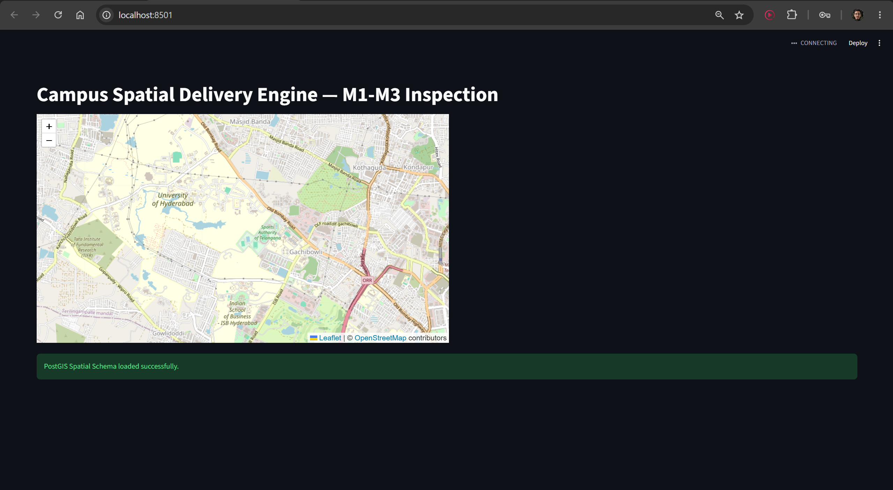

# 🛰️ Campus Spatiotemporal Delivery Engine
> **Course:** Advanced Database Systems (CS G516)  
> **Evaluation Milestone:** Mid-Semester (Labs 1–3 Deliverables)


---

## 📌 Executive Summary


This repository contains the mid-semester spatiotemporal engine baseline for a campus last-mile delivery system. Built using **PostgreSQL/PostGIS**, the system addresses high-concurrency spatial data ingestion by decoupling static transactional state tables from append-only high-frequency telemetry streams. 

The implementation covers physical schema generation, EPSG:4326 coordinate reference system (CRS) standardizations, spatial Generalized Search Tree (GiST) indexing, native PostGIS spatial operators, and an interactive GIS inspection interface.

---

## 📑 Lab-Wise Accomplishments Breakdown

| Lab Milestone | Core Objectives | Technical Implementation & Deliverables |
| :--- | :--- | :--- |
| **Lab 1: Schema & Indexing** | Physical schema modeling, Spatial CRS configuration, Indexing strategies | • Containerized PostgreSQL 15 + PostGIS 3.3 engine via Docker.<br>• Mapped geometries using `EPSG:4326` (WGS 84).<br>• Constructed `GEOMETRY(POLYGON)` and `GEOMETRY(POINT)` entities.<br>• Applied Generalized Search Tree (**GiST**) spatial indexes across geometry columns. |
| **Lab 2: Ingestion & Telemetry** | Spatial seeding, Boundary definition, Decoupled ingestion | • Seeded complex campus zone polygons via WKT (`ST_GeomFromText`).<br>• Linked delivery drop-offs (`delivery_location`) to zone foreign keys.<br>• Designed an **append-only time-series telemetry table** (`location_trace`) to eliminate row-locking during concurrent GPS pings. |
| **Lab 3: Operators & UI** | PostGIS query execution, Spatial mechanics, Interactive visualization | • Evaluated zone spatial containment via `ST_Contains`.<br>• Performed 500m geodesic proximity checks using `ST_DWithin`.<br>• Implemented $O(\log N)$ nearest-driver matching via KNN (`<->` operator).<br>• Built a Streamlit + Folium map dashboard (`app.py`). |

---

## 🗄️ Database Architecture & Entity-Relationship Model

```mermaid
erDiagram
    CAMPUS_ZONE {
        int zone_id PK
        string zone_name
        geometry boundary "POLYGON (SRID 4326)"
    }
    
    DELIVERY_LOCATION {
        int location_id PK
        string name
        int zone_id FK
        geometry point "POINT (SRID 4326)"
    }
    
    DRIVER {
        int driver_id PK
        string name
        string status
    }
    
    ORDER {
        int order_id PK
        int driver_id FK
        int destination_id FK
        string status
        timestamp created_at
    }
    
    LOCATION_TRACE {
        bigint trace_id PK
        int driver_id FK
        geometry location "POINT (SRID 4326)"
        timestamp recorded_at
    }

    CAMPUS_ZONE ||--o{ DELIVERY_LOCATION : "encloses (1:N)"
    DRIVER ||--o{ ORDER : "fulfills (1:N)"
    DELIVERY_LOCATION ||--o{ ORDER : "receives (1:N)"
    DRIVER ||--o{ LOCATION_TRACE : "emits telemetry (1:N)"